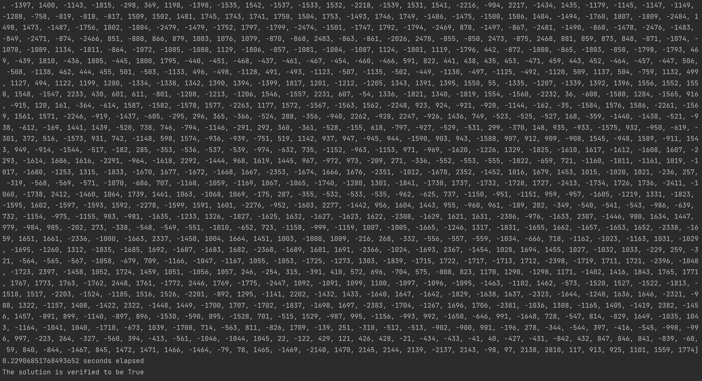

# <center>advanced-sat-solver</center>
## Description
A pure-python implemented SAT solver using CDCL equipped with several techniques, 
which include VSIDS, LRB, DLIS, MOMS, and so on.

## Usage
```python main.py [-h] [-a {VSIDS,LRB}] [-i INPUT]``` \
`python main.py -h` for more details.

### Arguments
``` -h, --help            show this help message and exit
  -a {VSIDS,LRB}, --assignment-alogrithm {VSIDS,LRB}
                        heuristic branching algorithm for assigning next literal
  -i INPUT, --input INPUT
                        specify the CNF file needs to be solved
```

### Example
```python main.py -a VSIDS -i ./examples/bmc-2.cnf```

## Currently tested efficiency
| File      | VSIDS  | LRB    |
|-----------|--------|--------|
| bcm-1.cnf | 136.2s | ...s   |
| bcm-2.cnf | 0.160s | 0.108s |
| bcm-7.cnf | 0.456s | 0.420s |

