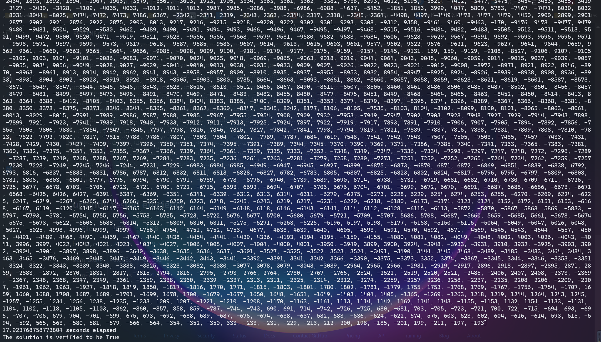

# <center>advanced-sat-solver</center>
## Description
A pure-python implemented SAT solver using CDCL equipped with several techniques, 
which include VSIDS, LRB, DLIS, MOMS, and so on.

## Usage
```python main.py [-h] [-a {VSIDS,LRB}] [-i INPUT]``` \
`python main.py -h` for more details.

### Arguments
``` -h, --help            show this help message and exit
  -a {VSIDS,LRB}, --assignment-alogrithm {VSIDS,LRB}
                        heuristic branching algorithm for assigning next literal
  -i INPUT, --input INPUT
                        specify the CNF file needs to be solved
```

### Example
```python main.py -a LRB -i ./examples/bmc-1.cnf```


## Currently tested efficiency
| File      | VSIDS  | ERMA   | RSR    | LRB    |
|-----------|--------|--------|--------|--------|
| bcm-1.cnf | 15.99s | 10.34s | 4.101s | 19.47s |
| bcm-2.cnf | 0.075s | 0.085s | 0.127s | 0.093s |
| bcm-7.cnf | 0.156s | 0.210s | 0.215s | 0.214s |

## Further reading
Some links for the details of all kinds of algorithm used
in this project

### ERMA & RSR & LRB
https://link.springer.com/chapter/10.1007/978-3-319-40970-2_9#Tab4
